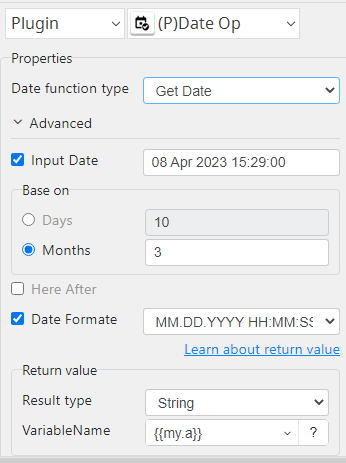
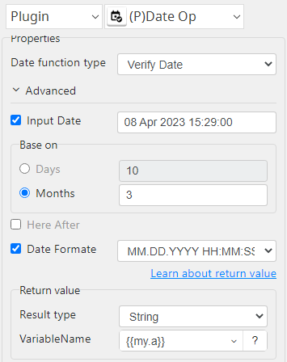

# Date Op

***Date Op with this plug-in can get and verify past and future dates.***

## Date Op
| Item         |        Value         |
|--------------|:--------------------:|
| Icon         |  |
| Display Name |     **Date Op**      |

### Arun Kumar (arunk@argos-labs.com)

Arun Kumar
* [email](mailto:arunk@argos-labs.com) 
 
## Version Control 
* [5.1125.1318](setup.yaml)
* Release Date: `November 25, 2023`

## Input (Required)
| Date function type | Parameters                  | Output       |
|--------------------|-----------------------------|--------------|
| Verify Date        | Input Date                  | output date  |
|                    | Days / Months               |              |
|                    | Here After(if coming days.) |              |
|                    | Output Date Format          |              |
| Get Date           | Input Date                  | output date  |
|                    | Days / Months               |              |
|                    | Here After(if coming days.) |              |
|                    | Output Date Format          |              |

## Return Value

### Normal Case
Description of the output result

## Return Code
| Code    | Meaning          |
|---------|------------------|
| 0       | Success          |
| 1       | Exceptional case |
| 98      | error            |

## Output Format
You may choose one of 3 output formats below,

<ul>
  <li>String (default)</li>
  <li>CSV</li>
  <li>File</li>
</ul>  

## Parameter setting examples (diagrams)

## Operations

### Get Date:

### Verify Date:

